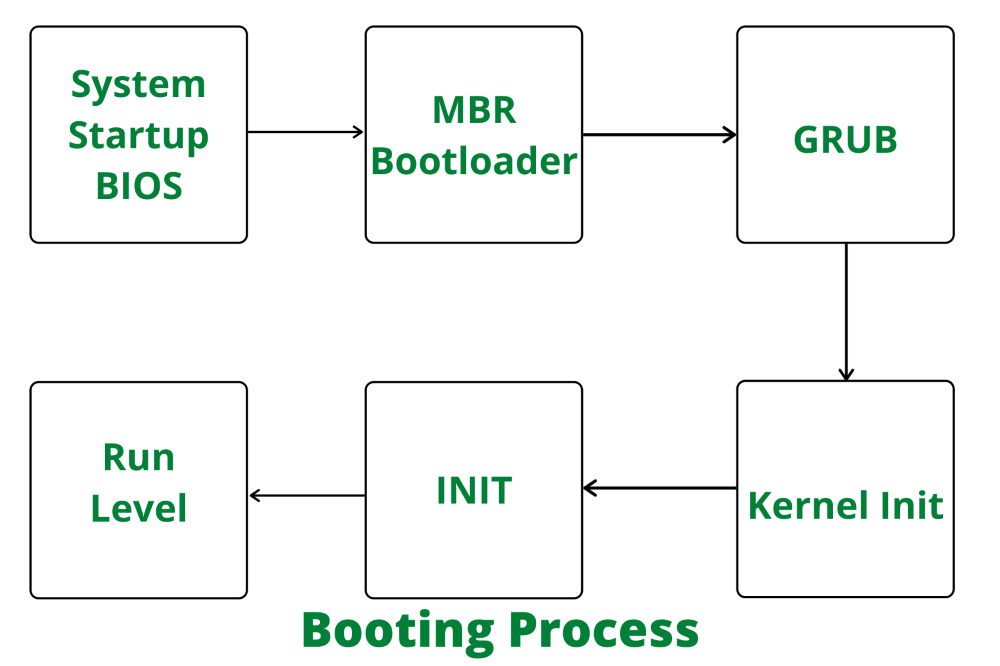

- Zombie Process: 
On Unix and Unix-like computer operating systems, a zombie process or defunct process is a process that has completed execution (via the exit system call) but still has an entry in the process table: it is a process in the "terminated state".

When a process completes its job, the Linux kernel notifies the exiting process’s parent by sending the SIGCHLD signal. The parent then executes the wait() system call to read the status of the child process and reads its exit code. This also cleans up the entry of the child process from the process table, and hence, the process finishes.

However, if a parent process isn’t programmed to execute the wait() system call on the creation of the child process, proper cleanup doesn’t happen. In such cases, the parent process cannot monitor the state changes of the child processes, and eventually, it ignores the SIGCHLD signal. This causes the zombie state of the finished process to stay in the process table, and hence it appears in the process list as a zombie process.

Another case of interest is when a parent process is unable to handle or receive the SIGCHLD signal from the child process. Such cases also lead to zombie creation.

We can identify the list of zombies using the ps command

ps ux

As observed from the output, the Z in the STAT column or zombie or <defunct> pattern from the output of the ps command can be used to identify the zombies.

Let’s further filter the output based on the Z process state using the awk command:

ps ux | awk '{if($8=="Z") print}'
shubh       108  0.0  0.0      0     0 tty1     Z    16:25   0:00 [zombie] <defunct>

Another convenient method for checking the number and list of zombie processes is to use the top command:

top

We can’t really kill a zombie process since it’s already dead. However, there are a few workarounds we can use to clean up a zombie process.

We can manually send the SIGCHLD signal to the parent of a zombie process. Consequently, it will intimate the parent to trigger the wait() system call, which will clean up the defunct child process from the process table.

Let’s find the parent id of our defunct process:

ps -A -ostat,pid,ppid | grep -e '[zZ]'
Z      108   103

This lists the STAT column, process id, and parent process id of zombie processes. Next, let’s send the SIGCHLD signal to the parent process using the kill command:

kill -s SIGCHLD 103

However, it isn’t really guaranteed that sending the SIGCHLD signal to the parent will kill a zombie process. It works only in cases where parent processes can handle the SIGCHLD signals.

- Linux Process states: 
Linux maintains a process table of all the processes running, along with their states. Let’s briefly overview the various process states:

Running (R): These processes are currently running or runnable.
Waiting (S/D): These are the processes that are waiting for an event or a resource. The wait can either be an interruptible sleep (S) or an uninterruptible sleep (D).
Stopped (T): We can stop a Linux process by sending an appropriate signal.
Zombie (Z): When a process finishes its task, it releases the system resources it was using and cleans up its memory. However, its entry from the process table is not removed, and its status is set as EXIT_ZOMBIE.

- Linux Boot Process: 
The machine’s BIOS (Basic Input/Output System) or boot microcode hundreds and runs a boot loader.
Boot loader finds the kernel image on the disk and loads it into memory, to start the system.
The kernel initializes the devices and their drivers.
The kernel mounts the basis filesystem.
The kernel starts a program referred to as init with a method ID zero
init sets the remainder of the system processes in motion.
For some purpose, init starts a method permitting you to log in, typically at the top or close to the top of the boot sequence.

- Troubleshooting steps in disk write/read is slow:
Check CPU load
Watch iostat/iotop output to determine if something else was writing
Check dmesg output for any kernel errors
Type “top” and press enter. This launches the top tool, which shows server statistics and a list of running processes. The wa metric shows IO-wait, the amount of time the CPU spends waiting for IO completion represented as a percentage.

