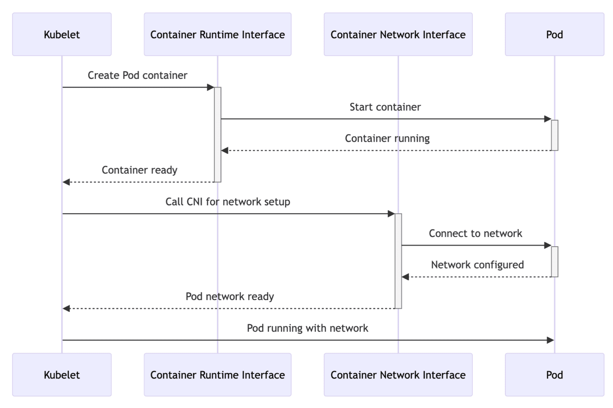
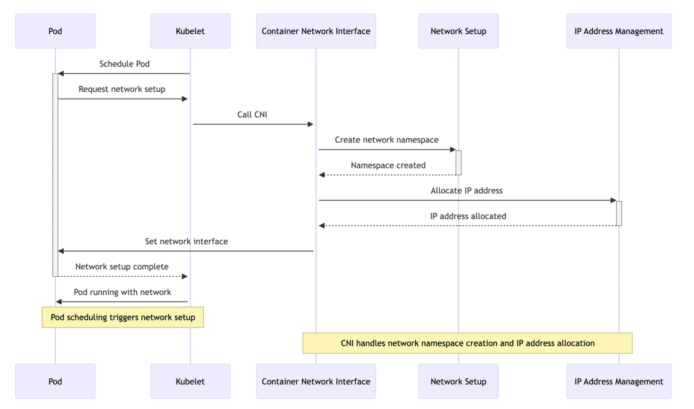
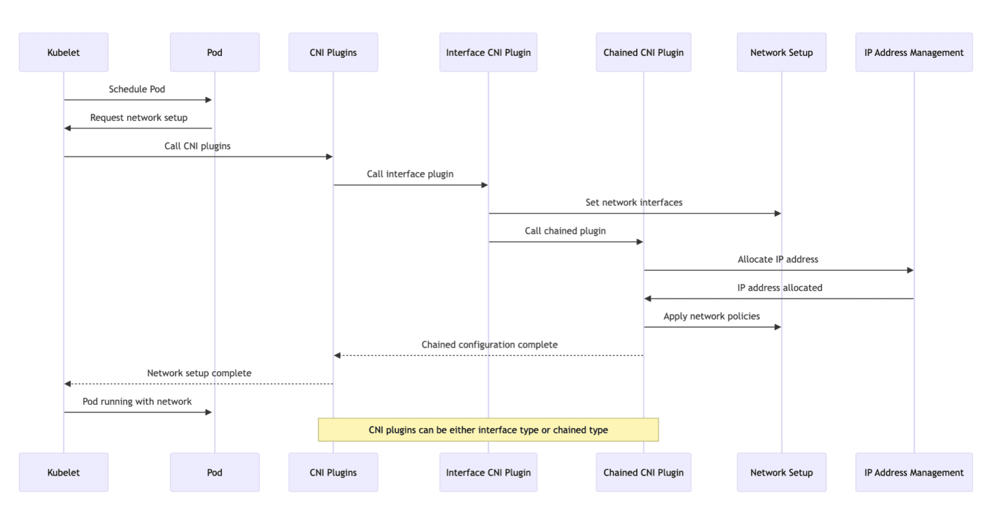
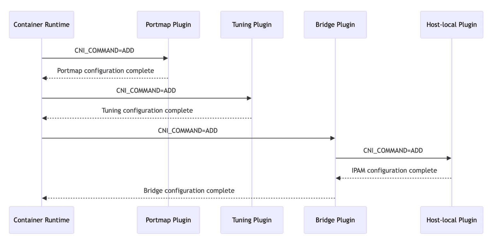

The CNI (Container Network Interface) specification provides a common interface between container runtimes and network plugins, aiming to standardize container network configuration.

The CNI specification comprises several core components:

- Network configuration format: Defines how administrators define network configurations.
- Request protocol: Describes how container runtimes send network configuration or cleanup requests to network plugins.
- Plugin execution process: Details how plugins execute network setup or cleanup based on the provided configuration.
- Plugin delegation: Allows plugins to delegate specific functionalities to other plugins.
- Result return: Defines the data format for returning results to the runtime after plugin execution.

By defining these core components, the CNI specification ensures that different container runtimes and network plugins can interact in a consistent manner, enabling automation and standardization of network configuration.

According to the CNI specification, a CNI plugin is responsible for configuring a container’s network interface in some way. Plugins can be classified into two major categories:

“Interface” plugins, responsible for creating network interfaces inside containers and ensuring their connectivity.
“Chained” plugins, adjusting the configuration of already created interfaces (but may need to create more interfaces to accomplish this).

Relationship Between CNI and CRI
CNI and CRI (Container Runtime Interface) are two critical interfaces in Kubernetes, responsible for container network configuration and runtime management, respectively. In Kubernetes clusters, CRI invokes CNI plugins to configure or clean up container networks, ensuring tight coordination between the network configuration process and container creation and destruction processes.

The following diagram intuitively illustrates how CNI collaborates with CRI:

1. Kubelet to CRI: The Kubelet instructs the CRI to create the containers for a scheduled pod.
2. CRI to Pod: The container runtime starts the container within the pod.
3. Pod to CRI: Once the container is running, it signals back to the container runtime.
4. CRI to Kubelet: The container runtime notifies the Kubelet that the containers are ready.
5. Kubelet to CNI: With the containers up, the Kubelet calls the CNI to set up the network for the pod.
6. CNI to Pod: The CNI configures the network for the pod, attaching it to the necessary network interface.
7. Pod to CNI: After the network is configured, the pod confirms network setup to the CNI.
8. CNI to Kubelet: The CNI informs the Kubelet that the pod’s network is ready.
9. Kubelet to Pod: The pod is now fully operational, with both containers running and network configured.
The following diagram shows the detailed steps involved in setting up networking for a pod in Kubernetes:

1. Pod scheduling: The Kubelet schedules a pod to run on a node.
2. Request network setup: The scheduled pod requests network setup from the Kubelet.
3. Invoke CNI: The Kubelet invokes the CNI to handle the network setup for the pod.
4. Create network namespace: The CNI creates a network namespace for the pod, isolating its network environment.
5. Allocate IP address: The CNI, through its IP Address Management (IPAM) plugin, allocates an IP address for the pod.
6. Setup network interfaces: The CNI sets up the necessary network interfaces within the pod’s network namespace, attaching it to the network.
7. Network setup complete: The pod notifies the Kubelet that its network setup is complete.
8. Pod running with network: The pod is now running with its network configured and can communicate with other pods and services within the Kubernetes cluster.

CNI Workflow:

The Container Network Interface (CNI) specification defines how containers should configure networks, including five operations: ADD, CHECK, DELETE, GC, and VERSION. Container runtimes execute these operations by calling various CNI plugins, enabling dynamic management and updates of container networks.

To elaborate on each step described in the sequence diagram, involving interactions between Kubelet, Pod, CNI plugins (both interface and chained), network setup, and IP address management (IPAM), let’s delve deeper into the process:

1. Schedule Pod: Kubelet schedules a Pod to run on a node. This step initiates the lifecycle of Pods within the Kubernetes cluster.
2. Request Network Setup: The Pod requests Kubelet for network setup. This request triggers the process of configuring the network for the Pod, ensuring its ability to communicate within the Kubernetes cluster.
3. Call CNI Plugins: Kubelet invokes configured Container Network Interface (CNI) plugins. CNI defines a standardized way for container management systems to set up network interfaces within Linux containers. Kubelet passes necessary information to CNI plugins to initiate network setup.
4. Call Interface Plugin: The CNI framework calls an interface CNI plugin responsible for setting up primary network interfaces for the Pod. This plugin may create a new network namespace, connect a pair of veth, or perform other actions to ensure the Pod has the required network interfaces.
5. Set Network Interfaces: The interface CNI plugin configures network interfaces for the Pod. This setup includes assigning IP addresses, setting up routes, and ensuring interfaces are ready for communication.
6. Call Chained Plugin: After setting up network interfaces, the interface CNI plugin or the CNI framework calls chained CNI plugins. These plugins perform additional network configuration tasks, such as setting up IP masquerading, configuring ingress/egress rules, or applying network policies.
7. Allocate IP Address: As part of the chained process, one of the chained CNI plugins may involve IP Address Management (IPAM). The IPAM plugin is responsible for assigning an IP address to the Pod, ensuring each Pod has a unique IP within the cluster or namespace.
8. IP Address Allocated: The IPAM plugin allocates an IP address and returns the allocation information to the calling plugin. This information typically includes the IP address itself, subnet mask, and possible gateway.
9. Apply Network Policies: Chained CNI plugins apply any specified network policies to the Pod’s network interfaces. These policies may dictate allowed ingress and egress traffic, ensuring network security and isolation per cluster configuration requirements.
10. Chained Configuration Complete: Once all chained plugins have completed their tasks, the overall network configuration for the Pod is considered complete. The CNI framework or the last plugin in the chain signals to Kubelet that network setup is complete.
11. Network Setup Complete: Kubelet receives confirmation of network setup completion from the Pod. At this point, the Pod has fully configured network interfaces with IP addresses, route rules, and applied network policies.
12. Pod Running with Network: The Pod is now running and has its network configured. It can communicate with other Pods within the Kubernetes cluster, access external resources per network policies, and perform its designated functions.

The following are example sequence diagrams and detailed explanations for the ADD, CHECK, and DELETE operations based on the CNI examples. Through these operations, interactions between the container runtime and CNI plugins facilitate dynamic management and updates of container network configurations.

ADD Operation Example

Below is the example sequence diagram and detailed explanation for the ADD operation:

1. Container Runtime Calls Portmap Plugin: The container runtime executes the ADD operation by calling the Portmap plugin to configure port mapping for the container.
2. Portmap Configuration Complete: The Portmap plugin completes the port mapping configuration and returns the result to the container runtime.
3. Container Runtime Calls Tuning Plugin: The container runtime invokes the Tuning plugin to execute the ADD operation and configure network tuning parameters for the container.
4. Tuning Configuration Complete: The Tuning plugin finishes configuring network tuning parameters and returns the result to the container runtime.
5. Container Runtime Calls Bridge Plugin: The container runtime calls the Bridge plugin to execute the ADD operation and configure network interfaces and IP addresses for the container.
6. Bridge Plugin Calls Host-local Plugin: Before completing its own configuration, the Bridge plugin calls the Host-local plugin to execute the ADD operation and configure IP addresses for the container.
7. IPAM Configuration Complete: The Host-local plugin, acting as the authority for IP Address Management (IPAM), completes IP address allocation and returns the result to the Bridge plugin.
8. Bridge Configuration Complete: The Bridge plugin finishes configuring network interfaces and IP addresses and returns the result to the container runtime.
These operations ensure that the required network configuration is set up as expected when the container starts, including port mapping, network tuning, and IP address allocation.